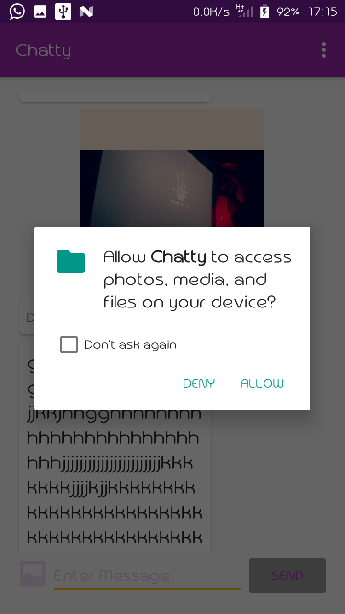

# Chatty

This repository contains code from the FriendlyChat project in the [Firebase in a Weekend: Android by Google](https://www.udacity.com/course/firebase-in-a-weekend-by-google-android--ud0352) Udacity course.
With a few modifications and updates

## Overview

Chatty is an app that allows users to send and receive text and photos in realtime across platforms.

## Setup

Setup requires creating a Firebase project. See https://firebase.google.com/ for more information.

## Screenshots
|   |  |  | |
|:---:|:---:|:---:|:---:|
| Login Activity | Login Activity | Permissions | Main Activity |

## Tools

[Dexter](https://github.com/Karumi/Dexter) -For Runtime Permissions

## License
See [LICENSE](LICENSE)
